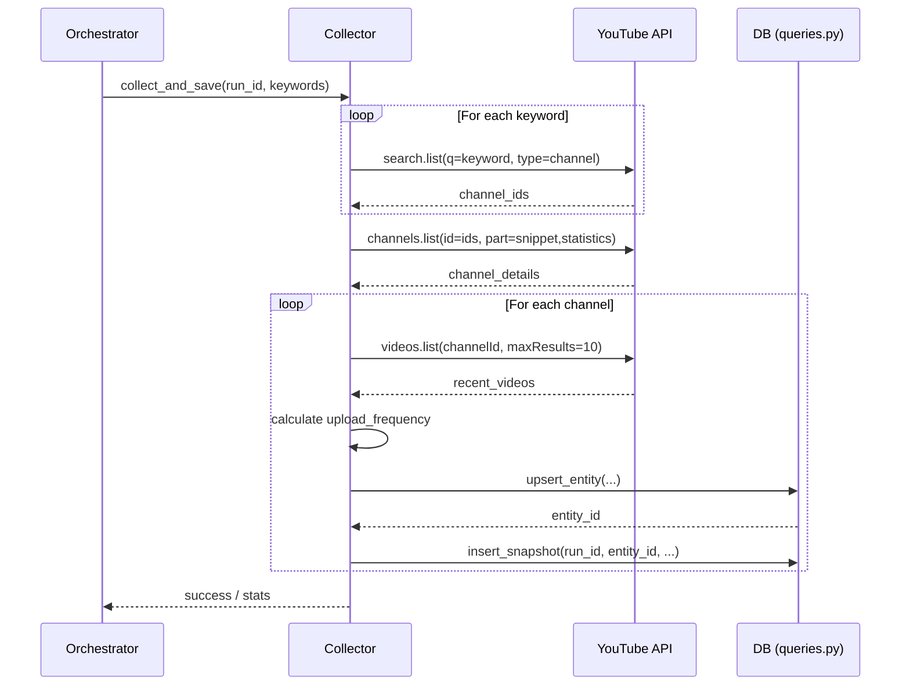

# Phase 2: Collector 詳細設計

YouTube API を使用してクリエイター情報（エンティティ）と統計情報（スナップショット）を収集する設計。

## 1. 処理フロー

## 2. データ構造 (Pydantic Models)

### `models/schemas.py`
- `YouTubeChannel`: YouTube API から取得した生のチャンネル情報。
- `YouTubeVideo`: 投稿頻度計算用の動画情報。
- `CollectorResult`: 収集結果のサマリー。

## 3. DB クエリ設計

### `scout_entities` (Upsert)
- `platform` ("youtube") と `platform_id` (channel_id) で衝突判定。
- `channel_title`, `description`, `country`, `language` 等を更新。

### `scout_snapshots` (Insert)
- `run_id`, `entity_id` に加え、`subscriber_count`, `view_count`, `video_count` を保存。

## 4. Quota 管理
- 1回のリクエスト（`run`）につき、新規検索はキーワード5つ程度に制限（100 * 5 = 500 quota）。
- `channels.list` は 50件まで一括取得可能（1 quota）。
- 投稿頻度の計算に必要な `videos.list` はチャンネルごとに 1回（1 quota）。
